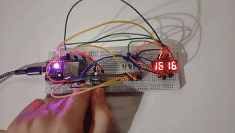
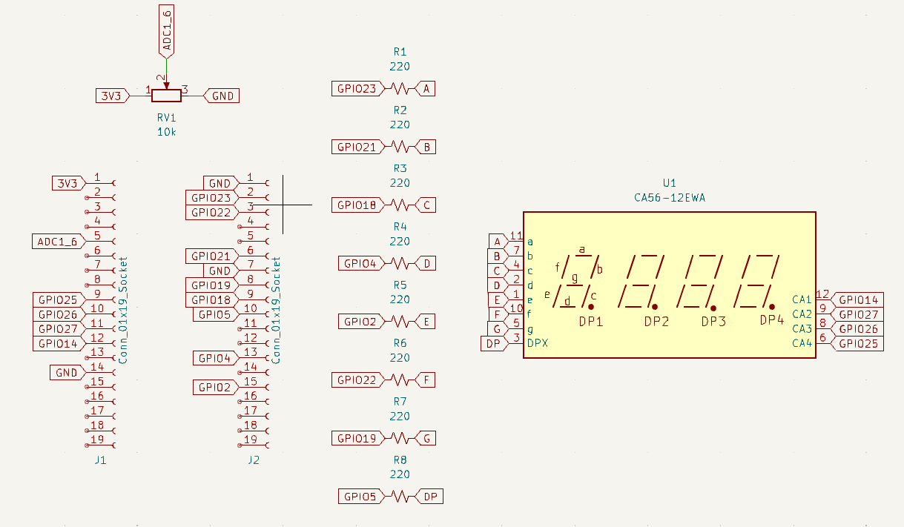
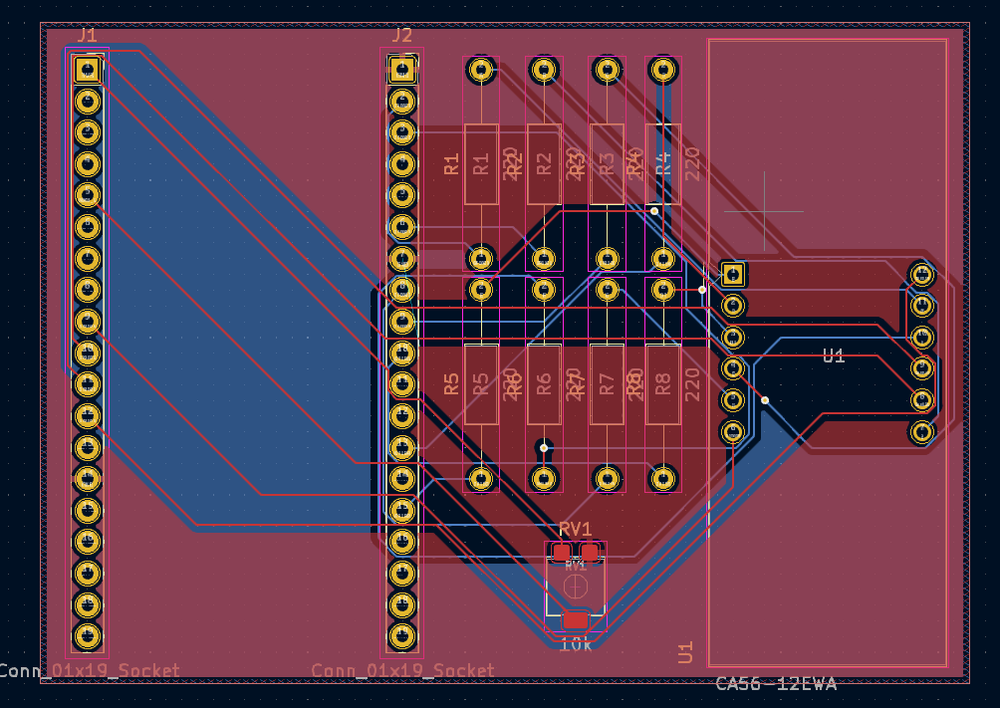
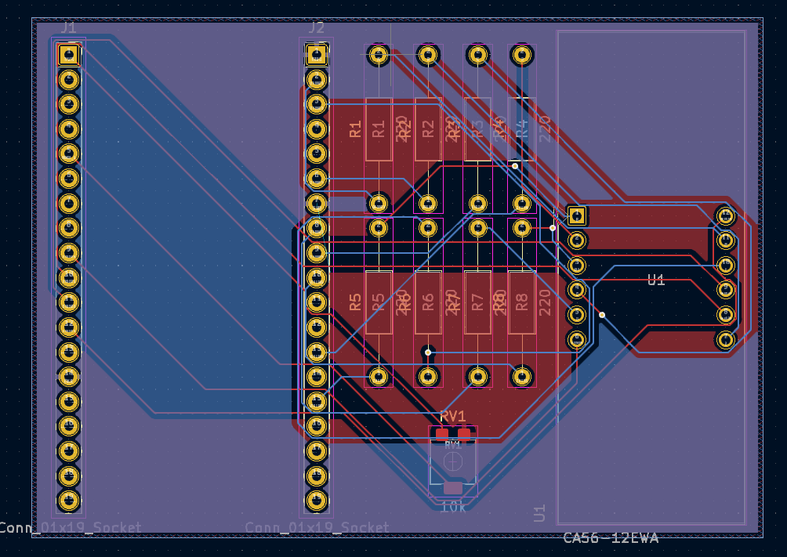
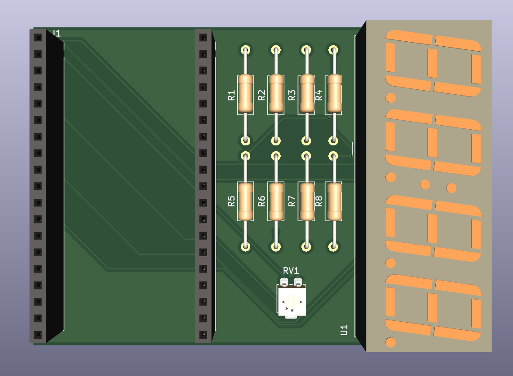
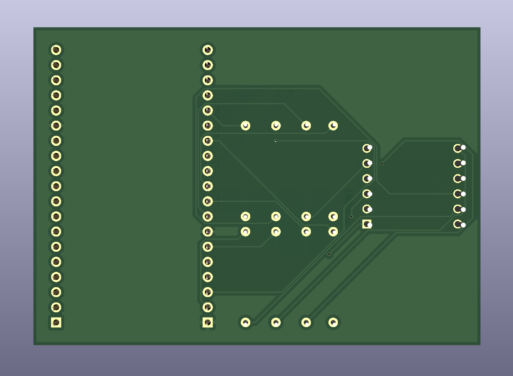
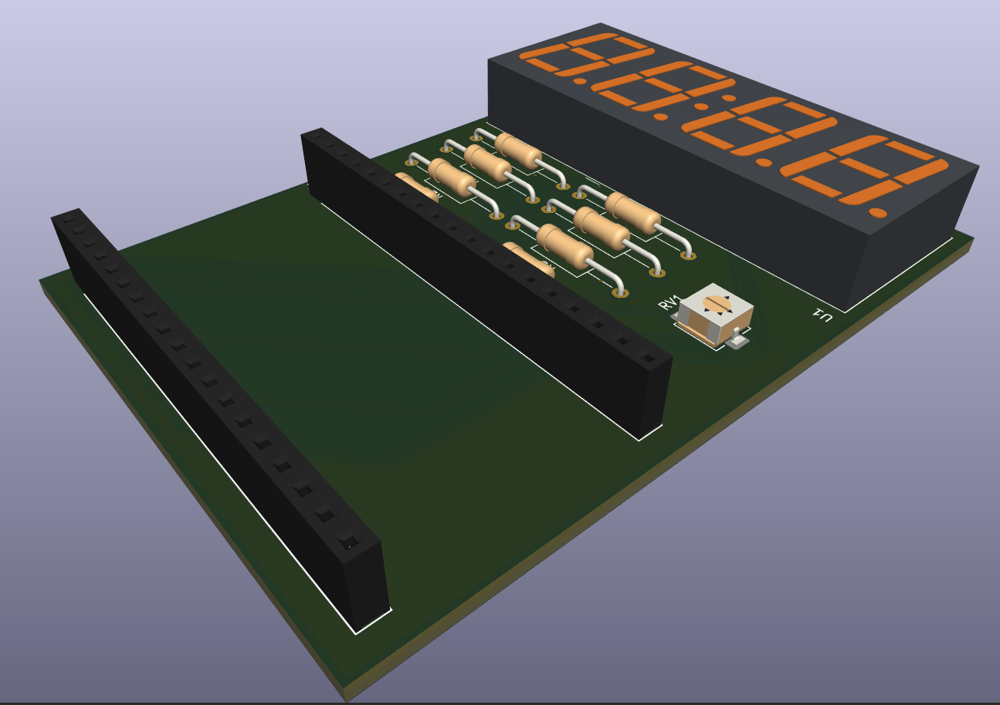

# 05 - ADC Potentiometer

A simple ESP32 project used to learn ADC (Analog-to-Digital Conversion) and how to work with a 7x4 segment display.

## Demo

## PCB Design

### Schematic

### PCB Top Layer

### PCB Bottom Layer

## 3D Model

