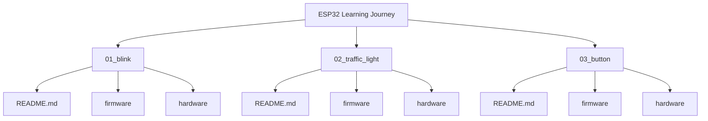

# ESP32 Learning Journey

This repository documents my hands-on journey into Embedded Systems and Firmware Engineering using the ESP32 and ESP-IDF with The C Programming Language.

The goal is to learn by building. Each project focuses on a specific concept, peripheral, or embedded programming technique while improving my understanding of electronics, real-time systems, hardware debugging, and firmware development.

Rather than creating production-ready applications, this repository serves as a collection of experiments, exercises, and practical projects that help me develop embedded engineering skills.

## What I'm Learning

* GPIO and Digital Electronics
* FreeRTOS
* Timers and Scheduling
* Interrupts
* UART, SPI, and I2C
* PWM, ADC, and DAC
* Sensors and Actuators
* Wi-Fi and Bluetooth
* Hardware Debugging
* PCB Design with KiCad
* ESP-IDF Development

## Repository Structure

## Projects

| Project                                              | Concept                                         |
| ---------------------------------------------------- | ----------------------------------------------- |
| [01 - Blink](./01_blink/README.md)                   | Basic GPIO output and ESP-IDF project structure |
| [02 - Traffic Light](./02_traffic_light/README.md)   | Multiple GPIO outputs and timing control        |
| [03 - Button](./03_button/README.md)                 | GPIO input, ISR and IRAM attr                   |

## Why This Repository Exists

I created this repository to:

* Track my progress in embedded development.
* Document what I learn while working with ESP32 devices.
* Practice firmware engineering concepts through real projects.
* Build a portfolio that reflects my growth as an embedded developer.
* Create a reference for future projects.